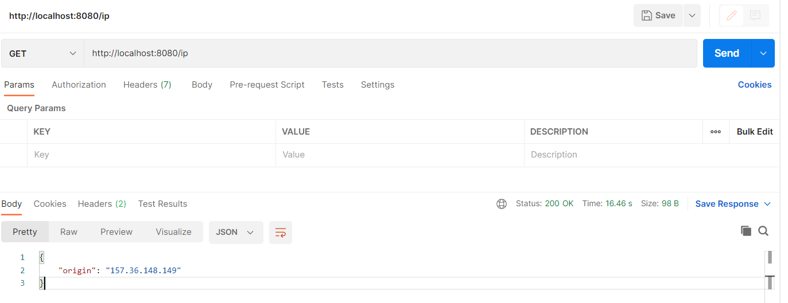
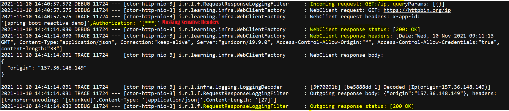
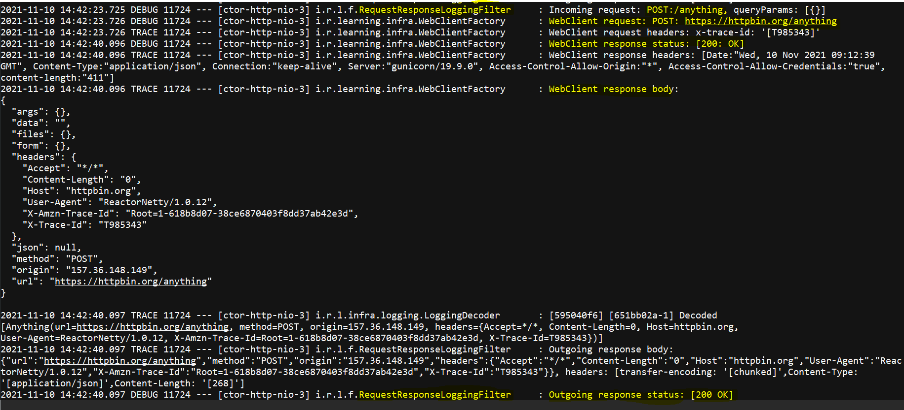

# SpringBoot Reactive WebClient 
## :mag: Tracing HTTP Request through a single pane of glass
 Decorating Spring Boot Reactive WebClient for tracing the request and response data for http calls.

# Pre-requisites
- Java 11
- Maven

## How to build and run
- mvn clean package
- mvn spring-boot:run

## Decorating WebClient
```
public WebClient.Builder decorateBuilder(WebClient.Builder builder) {
    return builder
        .clone()
        .filter(logRequest())
        .filter(logResponseStatus())
        .codecs(codecConfigurer -> {
            codecConfigurer.defaultCodecs().jackson2JsonEncoder(loggingEncoder);
            codecConfigurer.defaultCodecs().jackson2JsonDecoder(loggingDecoder);
        });
}
```

## API Endpoints
- GET **/ip**
- POST **/anything**

# Testing

## Send a GET request
```
curl -X GET 'http://localhost:8080/ip'
```


## GET Request Tracing


## Send a POST request
```
curl -X POST 'http://localhost:8080/anything'
```


## POST Reqeuest Tracing

